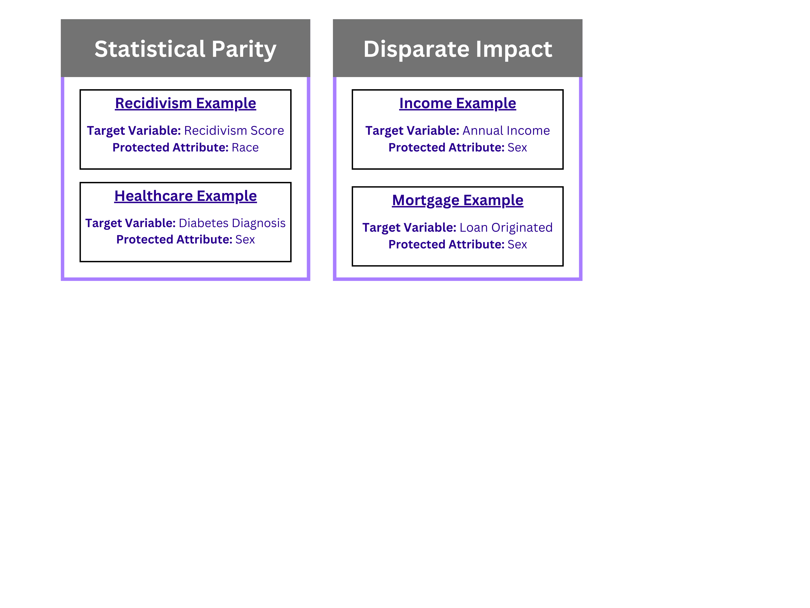
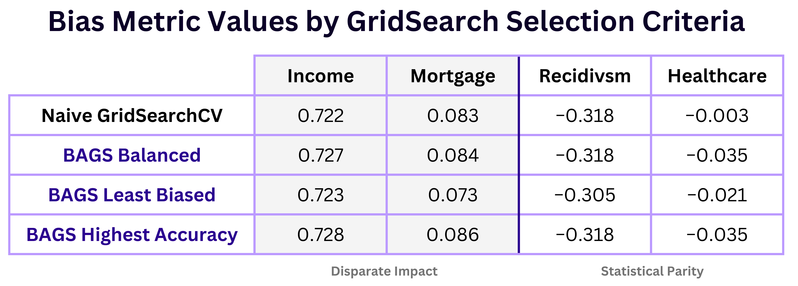
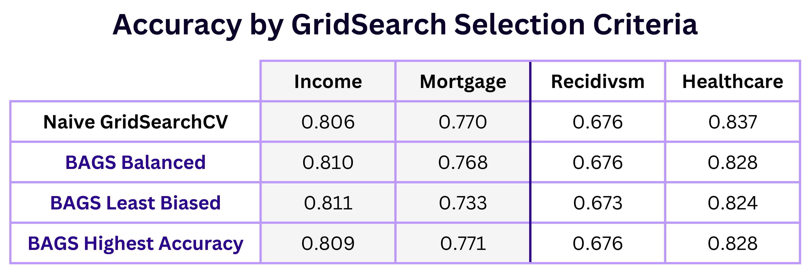
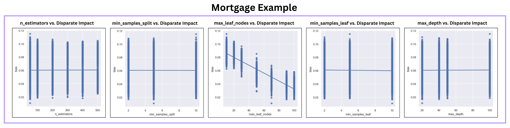

# BAGS: Bias Aware Gridsearch(CV)
{: .fs-9 }

An exploratory venture into including bias considerations into the classical machine learning pipeline.
{: .fs-6 .fw-300 }

[Get started now][getting started]{: .btn .btn-primary .fs-5 .mb-4 .mb-md-0 .mr-2 }
[View it on GitHub][bags repo]{: .btn .btn-primary .fs-5 .mb-4 .mb-md-0 .mr-2 }
[Check out our Paper][bags paper]{: .btn .btn-primary .fs-5 .mb-4 .mb-md-0 .mr-2 }

---

{: .note } 
Specific use cases and detailed examples can be found in the repo.

BiasAwareGridSearchCV is a Python tool created to address a critical need in machine learning: reducing bias. Developed as an extension of scikit-learn, this package helps data professionals build fairer machine learning models by integrating bias into the classical machine learning workflow. It’s designed for situations where decisions could be influenced by factors like gender or race, and where it’s crucial to ensure these decisions are as unbiased as possible.

Our tool stands out by not only measuring model performance in terms of accuracy but also considering how fair a model is. With BiasAwareGridSearchCV, you can evaluate and select models based on both their accuracy and their level of exhibited bias as well as visualize features for a clearer understanding of the trade-offs between bias and accuracy.

## Overview

<!--  -->

<!--  -->

The package is user-friendly and fits smoothly into standard machine learning workflows. The figure shows a simplified view of the machine learning process. 

Our algorithm is created to be used during the “Hyperparameter Tuning” stage, where the selected model is trained using various parameters and evaluated. Our tool inserts bias consideration into this step by making it a factor in model evaluation alongside traditional performance metrics.

In short, BiasAwareGridSearchCV is our effort to ensure that AI and machine learning contribute positively and fairly to our society, providing tools that help mitigate bias in automated decision-making.

 
 
 
 

{: .note } 
This work runs adjacent to existing bias mitigation techniques - it is presented as a novel step to the pre-processing, in-processing, and post-processing steps that already exist.

## Data

Our project’s purpose is to incorporate bias consideration into the evaluation of machine learning models, many of which are used to aid in decision making across a multitude of areas. For the development of this tool, we wanted to have a broad scope of the types of scenarios where bias may have a significant impact on predicted outcomes. To do this, we decided to analyze 4 different datasets available for public use, each highlighting a different example of how bias can present itself in common contexts. The datasets we analyzed followed these domains:
  - Income Prediction
  - Mortgage Origination
  - Recidivism Scores
  - Diabetes Diagnosis

## Methodology
### Preprocessing
Each dataset was individually cleaned, processed, and explored based on the focus of that dataset’s domain. BAGS is currently only applicable to classification tasks, so we ensured that each dataset could meet that constraint. Each dataset had to contain both a target variable and a protected attribute. The target variable is the variable being predicted, and a protected attribute is the feature sensitive to bias. Below are the specific features selected for each domain.

### Development
Our algorithm is heavily modeled after sklearn’s GridSearchCV, with a few key differences. For simplicity and resource management purposes, we selected RandomForestClassifier models as our estimator and created the functions for two bias metrics: [statistical parity](https://474benchen.github.io/bias_aware_gridsearchCV/documentation/bias_functions/statistical_parity) and [disparate impact](https://474benchen.github.io/bias_aware_gridsearchCV/documentation/bias_functions/disparate_impact). BAGS integrates the selected bias function into the cross validation step of GridSearchCV, with the ability to utilize any bias metric as long as the ideal value is 0.

When adding an additional evaluation layer to a search like this one, the determination of what makes up the “best” model becomes quite subjective. For the purposes of customizability, we integrated 4 different selection criteria methods:
- select_highest_accuracy_model()
    - Selects the model with the overall best accuracy score
- select_least_biased_model()
    - Selects the model with the overall least bias metric value
- select_balanced_model()
    - Selects the model with the best bias among a set of the highest accuracy models
- select_optimum_model()
    - Selects the model with the best bias given a certain margin of error for accuracy

With the ability to choose based on the needs of the problem at hand, we are able to further leverage the scope of BAGS to a variety of use cases. For further analysis, we also developed the ability to plot the relationships bias had with accuracy and any tested continuous parameter.  
- plot_accuracy()
    - Displays a bias metric vs. accuracy plot for all combinations of the grid search
- plot_params()
    - Displays a bias metric vs. parameter plot for all combinations of the grid search

 
## Results
Our package is not a bias mitigation tool, instead it is for the purposes of bias awareness and optimization. Thus, most results from all four domains showed only slight improvements in bias when compared to naive gridsearch methods. The table below depicts various selection criteria and their respective test set bias metrics, after retraining each selected model.

For the most part, bias stayed relatively the same across the board. Slight improvements were made using the BAGS least biased model, as seen in both the Mortgage and Recidivism examples.

As displayed below, accuracy values across the domains followed a similar pattern; accuracy for BAGS models tended to be similar to that of the naive gridsearch except for the least biased model selection, where accuracy decreased. The exception to this was seen in the Income example, in which the least biased test accuracy was the highest (by a small margin) compared to all other selection criteria. 

Despite the overall lack of bias reduction, we were able to use our package to make insights into what factors may contribute to inflated bias. BAGS includes plot functions plot_accuracy and plot_params which help to visualize the relationships accuracy and each parameter had during the gridsearch. Below are the results from plot_params for the Mortgage example, plots for the other domains can be found in our [report](bags paper).

As seen above, max_leaf_nodes has the strongest relationship to bias of the parameters we tested. This discovery was consistent across all four domains: as max_leaf_nodes increased, bias improved. 

We discovered that more accurate models also tend to be fairer. All four domains showed that, to some degree, models with higher accuracies exhibited less bias. This finding aligns with the intuitive behavior of bias; a model which better represents a given dataset will be able to output more accurate and fairer predictions by making fewer assumptions. 

## Discussion and Conclusion
In the field of machine learning, the delicate issue of fairness is ever present in almost every step of the process. As AI decision making models become more integrated into everyday life, research on the role of bias in these models have led to several advancements addressing problems of potential unfairness. IBM’s AI 360 Fairness toolkit, for example, is used to detect and mitigate biases when creating models. This toolkit provides insights to bias metrics such as disparate impact, statistical parity, Theil index, equal opportunity difference, and more. Packages such as this one provide awareness of the importance of fairness in model consideration, but even they have their limitations. 

Bias mitigation techniques such as reweighing, prejudice remover, and disparate impact remover are useful in certain situations, but carry with them an array of setbacks. Depending on the specific dataset and use, bias is sometimes necessary in order to have a comprehensive understanding of what features constitute each class. In cases where bias is rightfully present in real life, applying bias mitigation techniques could cause a model to provide unrealistic and inaccurate results. An example of this in practice can be seen [here](https://474benchen.github.io/bias_aware_gridsearchCV/caution/).

Though BAGS alone did not result in any significant reduction in bias among the selected models, it did offer insight on a previously hidden aspect of hyperparameter tuning: the changes in bias by each gridsearch combination. Our findings are a good starting point to spark more research on what introduces or emphasizes bias in ML models and what mitigation strategies can be used to aid in reducing bias while not compromising the integrity of the model. Our project can be expanded upon by making it compatible with more types of models, such as XGBoost and LightGBM, and analyzing the impact each parameter has on bias throughout the grid search. These results can be used by developers to aid in their reasoning when choosing a model to use. Another way we could broaden the scope of our project is by testing other types of bias metrics and analyzing the behavior of bias throughout the grid search. By further analyzing the relationships between parameters and bias metrics, developers can make a more informed decision on what bias metric would be the best fit for their uses.

[bags repo]: https://github.com/474benchen/bias_aware_gridsearchCV/tree/main
[bags paper]: https://github.com/474benchen/bias_aware_gridsearchCV/blob/main/docs/report.pdf
[getting started]: https://474benchen.github.io/bias_aware_gridsearchCV/getting_started/
