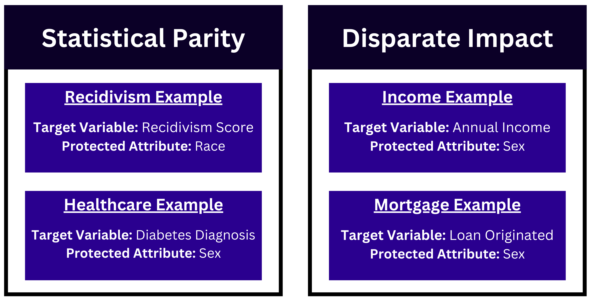

# BAGS: Bias Aware Gridsearch(CV)
{: .fs-9 }

An exploratory venture into including bias considerations into the classical machine learning pipeline.
{: .fs-6 .fw-300 }

[Get started now][getting started]{: .btn .btn-primary .fs-5 .mb-4 .mb-md-0 .mr-2 }
[View it on GitHub][bags repo]{: .btn .btn-primary .fs-5 .mb-4 .mb-md-0 .mr-2 }
[Check out our Paper][bags paper]{: .btn .btn-primary .fs-5 .mb-4 .mb-md-0 .mr-2 }

---

{: .note } 
Specific use cases and detailed examples can be found in the repo.

BiasAwareGridSearchCV is a Python tool created to address a critical need in machine learning: reducing bias. Developed as an extension of scikit-learn, this package helps data professionals build fairer machine learning models by integrating bias into the classical machine learning workflow. It’s designed for situations where decisions could be influenced by factors like gender or race, and where it’s crucial to ensure these decisions are as unbiased as possible.

Our tool stands out by not only measuring model performance in terms of accuracy but also considering how fair a model is. With BiasAwareGridSearchCV, you can evaluate and select models based on both their accuracy and their level of exhibited bias as well as visualize features for a clearer understanding of the trade-offs between bias and accuracy.

## Overview

<!--  -->

<!--  -->

The package is user-friendly and fits smoothly into standard machine learning workflows. The figure shows a simplified view of the machine learning process. 

Our algorithm is created to be used during the “Hyperparameter Tuning” stage, where the selected model is trained using various parameters and evaluated. Our tool inserts bias consideration into this step by making it a factor in model evaluation alongside traditional performance metrics.

In short, BiasAwareGridSearchCV is our effort to ensure that AI and machine learning contribute positively and fairly to our society, providing tools that help mitigate bias in automated decision-making.

 
 
 
 

{: .note } 
This work runs adjacent to existing bias mitigation techniques - it is presented as a novel step to the pre-processing, in-processing, and post-processing steps that already exist.

## Data

Our project’s purpose is to incorporate bias consideration into the evaluation of machine learning models, many of which are used to aid in decision making across a multitude of areas. For the development of this tool, we wanted to have a broad scope of the types of scenarios where bias may have a significant impact on predicted outcomes. To do this, we decided to analyze 4 different datasets available for public use, each highlighting a different example of how bias can present itself in common contexts. The datasets we analyzed followed these domains:
  - Income Prediction
  - Mortgage Origination
  - Recidivism Scores
  - Diabetes Diagnosis

## Methodology
### Preprocessing
Each dataset was individually cleaned, processed, and explored based on the focus of that dataset’s domain. BAGS is currently only applicable to classification tasks, so we ensured that each dataset could meet that constraint. Each dataset had to contain both a target variable and a protected attribute. The target variable is the variable being predicted, and a protected attribute is the feature sensitive to bias. Below are the specific target variables and protected attributes selected for each domain.

### Development
For the purposes of our project, we decided to focus on RandomForest models, using either [statistical parity](https://474benchen.github.io/bias_aware_gridsearchCV/documentation/bias_functions/statistical_parity) or [disparate impact](https://474benchen.github.io/bias_aware_gridsearchCV/documentation/bias_functions/disparate_impact) as the bias metric. The basis of our tool is heavily modeled after sklearn’s GridSearchCV. We modified it by adding in a bias evaluation layer, where one would be able to select models using varied criteria. Our method allows the selection of the least biased model, most accurate model, or most balanced model. 

## Results
Our package is not a bias mitigation tool, instead it is for the purposes of bias awareness and optimization. Thus, results from all four domains showed minimal improvements in bias when compared to naive gridsearch methods. 

*figure showing naive vs balanced bias stat; tbd bc I dont have all the values available right now*

Despite the overall lack of bias reduction, we were able to use our package to make insights into what factors may contribute to inflated bias. BAGS includes plot functions plot_accuracy and plot_params which help to visualize the relationships accuracy and each parameter had during the gridsearch.

*plots; debating whether to delve into one domain or briefly describe each one. Don’t want the homepage to be too cluttered with plots*

We discovered that more accurate models also tend to be fairer. *(explaining how this makes sense given that more accurate models are truer to the data they are attempting to make predictions on)*

We also found that select parameters carry more weight on bias present in the model than others. Based on our observations, parameters such as n_estimators and max_leaf_nodes tend to make a significant impact on bias throughout the search.

[bags repo]: https://github.com/474benchen/bias_aware_gridsearchCV/tree/main
[bags paper]: https://www.google.com/
[getting started]: https://474benchen.github.io/bias_aware_gridsearchCV/getting_started/
